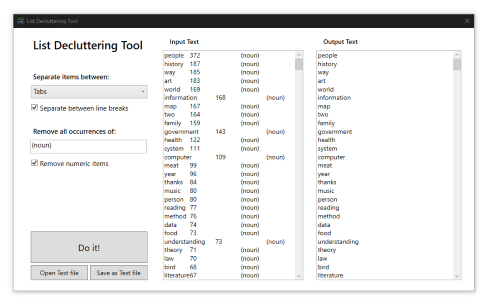

# List Decluttering Tool

**List Decluttering Tool** is a free tool that simplifies your lists and help you extract useful data from your clipboard pretty fast!

**What it can do for you:**

- Makes you data more readable and simple.
- Extracts big amounts of data from anywhere with a simple *Copy & Paste* without worries.
- Restructures your data in a snap to simplify its use in any algorithm.
- Ignores non-useful formatting stuff to give you what matters.

